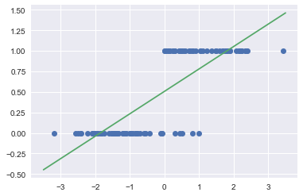
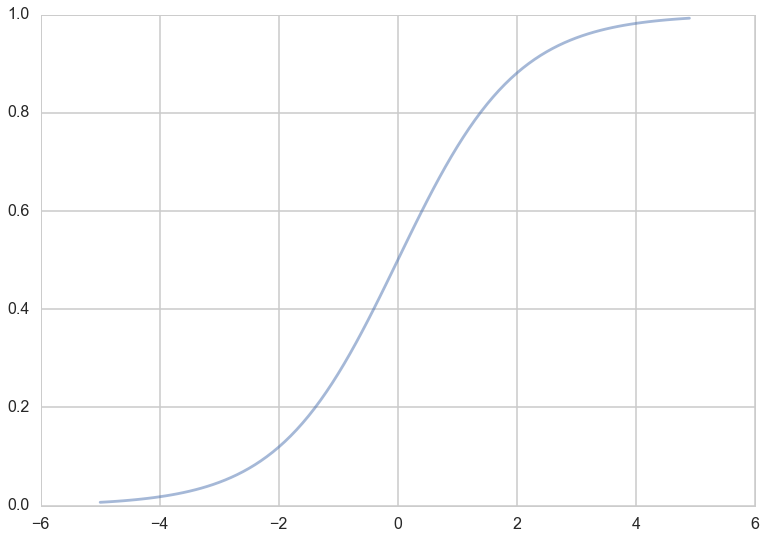
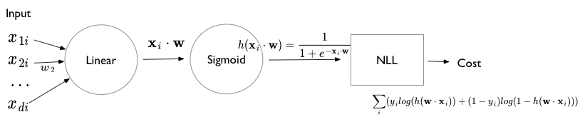
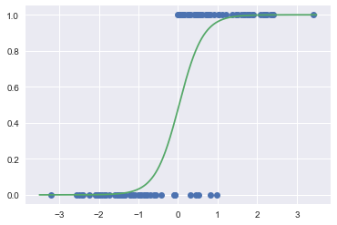
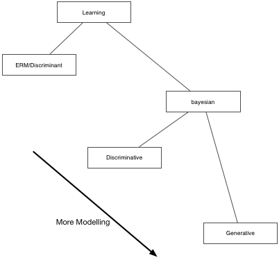
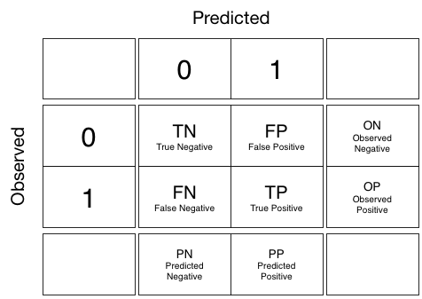

autoscale: true


#[fit]Day 2 Session 1

## Logistic Regression and Generative Models

---

#[fit]CLASSIFICATION

- will a customer churn?
- is this a check? For how much?
- a man or a woman?
- will this customer buy?
- do you have cancer?
- is this spam?
- whose picture is this?
- what is this text about?[^j]


[^j]:image from code in http://bit.ly/1Azg29G

---

# PROBABILISTIC CLASSIFICATION


In any machine learning problem we want to model $$p(x,y)$$.

---

We can choose to model as

$$p(x,y) = p(y \mid x) p(x)$$ or $$p(x \mid y) p(y)$$

In regression we modeled the former. In logistic regression, with $$y=c$$ (class $$c$$) we model the former as well. This is the probability of the class given the features $$x$$.

In "Generative models" we model the latter, the probability of the features given the class.

---

## 1-D classification problem


---

## 1-D Using Linear regression



---

##[fit] MLE for Logistic Regression

- example of a Generalized Linear Model (GLM)
- "Squeeze" linear regression through a **Sigmoid** function
- this bounds the output to be a probability
- What is the sampling Distribution?

---

## Sigmoid function

This function is plotted below:

```python
h = lambda z: 1./(1+np.exp(-z))
zs=np.arange(-5,5,0.1)
plt.plot(zs, h(zs), alpha=0.5);
```



Identify: $$\renewcommand{\v}[1]{\mathbf #1} z = \v{w}\cdot\v{x}$$ and $$ \renewcommand{\v}[1]{\mathbf #1} h(\v{w}\cdot\v{x})$$ with the probability that the sample is a '1' ($$y=1$$).

---

Then, the conditional probabilities of $$y=1$$ or $$y=0$$ given a particular sample's features $$\renewcommand{\v}[1]{\mathbf #1} \v{x}$$ are:

$$\begin{eqnarray}
\renewcommand{\v}[1]{\mathbf #1}
P(y=1 | \v{x}) &=& h(\v{w}\cdot\v{x}) \\
P(y=0 | \v{x}) &=& 1 - h(\v{w}\cdot\v{x}).
\end{eqnarray}$$

These two can be written together as

$$\renewcommand{\v}[1]{\mathbf #1} P(y|\v{x}, \v{w}) = h(\v{w}\cdot\v{x})^y \left(1 - h(\v{w}\cdot\v{x}) \right)^{(1-y)} $$

BERNOULLI!!

---
[.autoscale: true]

Multiplying over the samples we get:

$$\renewcommand{\v}[1]{\mathbf #1} P(y|\v{x},\v{w}) = P(\{y_i\} | \{\v{x}_i\}, \v{w}) = \prod_{y_i \in \cal{D}} P(y_i|\v{x_i}, \v{w}) = \prod_{y_i \in \cal{D}} h(\v{w}\cdot\v{x_i})^{y_i} \left(1 - h(\v{w}\cdot\v{x_i}) \right)^{(1-y_i)}$$

Indeed its important to realize that a particular sample can be thought of as a draw from some "true" probability distribution.

 **maximum likelihood** estimation maximises the **likelihood of the sample y**, or alternately the log-likelihood,

$$\renewcommand{\v}[1]{\mathbf #1} {\cal L} = P(y \mid \v{x},\v{w}).$$ OR $$\renewcommand{\v}[1]{\mathbf #1} \ell = log(P(y \mid \v{x},\v{w}))$$

---

Thus

$$\renewcommand{\v}[1]{\mathbf #1} \begin{eqnarray}
\ell &=& log\left(\prod_{y_i \in \cal{D}} h(\v{w}\cdot\v{x_i})^{y_i} \left(1 - h(\v{w}\cdot\v{x_i}) \right)^{(1-y_i)}\right)\\
                  &=& \sum_{y_i \in \cal{D}} log\left(h(\v{w}\cdot\v{x_i})^{y_i} \left(1 - h(\v{w}\cdot\v{x_i}) \right)^{(1-y_i)}\right)\\
                  &=& \sum_{y_i \in \cal{D}} log\,h(\v{w}\cdot\v{x_i})^{y_i} + log\,\left(1 - h(\v{w}\cdot\v{x_i}) \right)^{(1-y_i)}\\
                  &=& \sum_{y_i \in \cal{D}} \left ( y_i log(h(\v{w}\cdot\v{x})) + ( 1 - y_i) log(1 - h(\v{w}\cdot\v{x})) \right )
\end{eqnarray}$$

---
[.autoscale: true]

## Logistic Regression: NLL

The negative of this log likelihood (NLL), also called *cross-entropy*.

$$\renewcommand{\v}[1]{\mathbf #1} NLL = - \sum_{y_i \in \cal{D}} \left ( y_i log(h(\v{w}\cdot\v{x})) + ( 1 - y_i) log(1 - h(\v{w}\cdot\v{x})) \right )$$

Gradient:  $$\renewcommand{\v}[1]{\mathbf #1} \nabla_{\v{w}} NLL = \sum_i \v{x_i}^T (p_i - y_i) = \v{X}^T \cdot ( \v{p} - \v{w} )$$

Hessian: $$\renewcommand{\v}[1]{\mathbf #1} H = \v{X}^T diag(p_i (1 - p_i))\v{X}$$ positive definite $$\implies$$ convex

---

## Units based diagram




---

## 1-D Using Logistic regression




---


#[fit]CLASSIFICATION

#[fit]BY LINEAR SEPARATION

#Which line?

- Different Algorithms, different lines.

- SVM uses max-margin[^j]


---


#DISCRIMINATIVE CLASSIFIER
$$P(y|x): P(male | height, weight)$$


---

## Discriminative Learning

- are these classifiers any good?
- they are discriminative and draw boundaries, but thats it
- they are cheaper to calculate but shed no insight
- would it not be better to have a classifier that captured the generative process

---

## Throwing darts, uniformly


Throwing darts at the wall to find P(A|B). (a) Darts striking the wall. (b) All the darts in either A or B. (c) The darts only in B. (d) The darts that are in the overlap of A and B.

(pics like these from Andrew Glassner's book)

---

# Conditional Probability


conditional probability tells us the chance that one thing will happen, given that another thing has already happened. In this case, we want to know the probability that our dart landed in blob A, given that we already know it landed in blob B.

---

## Other conditional and joint


Left: the other conditional

Below: the joint probability $$p(A, B)$$, the chance that any randomly-thrown dart will land in both A and B at the same time.


---

## The joint probability can be written 2 ways


---

# Bayes Theorem

Equating these gives us Bayes Theorem.

$$P(A \mid B) P(B) = P(B \mid A) P(A)$$

$$P(A \mid B)  = \frac{P(B \mid A) P(A)}{P(B)}$$

the LHS probability $$P(A \mid B)$$is called the posterior, while P(A) is called the prior, and p(B) is called the evidence

---

#GENERATIVE CLASSIFIER
$$P(y|x) \propto P(x|y)P(x): P(height, weight | male) \times P(male)$$


---

## Representation Learning

- the idea of generative learning is to capture an underlying representation (compressed) of the data
- in the previous slide it was 2 normal distributions
- generally more complex, but the idea if to fit a "generative" model whose parameters represent the process
- besides gpus and autodiff , this is the third pillar of the AI rennaissance: the choice of better representations: e.g. convolutions

---

## Generative vs Discriminative classifiers

- LDA vs logistic respectively.
- LDA is generative as it models $$p(x | c)$$ while logistic models $$p( c | x)$$ directly.
- generative handles data asymmetry better, can add new classes to a generative classifier without retraining so better for online customer selection problems
- sometimes generative models like LDA and Naive Bayes are easy to fit. Discriminative models require convex optimization via Gradient descent
- generative classifiers can handle missing data easily
- generative classifiers are better at handling unlabelled training data (semi-supervized learning)
- preprocessing data is easier with discriminative classifiers
- discriminative classifiers give generally better callibrated probabilities
- discriminative usually less expensive

---



---


#EVALUATING CLASSIFIERS


---

## Metrics (from Glassner)

- accuracy is a number from 0 to 1. It’s a general measure of how often the prediction is correct.
- Precision (also called positive predictive value, or PPV) tells us the percentage of our samples that were properly labeled “positive,” relative to all the samples we labeled as “positive.” Numerically, it’s the value of TP relative to TP+FP. In other words, precision tells us how many of the “positive” predictions were really positive.
- recall, (also called sensitivity, hit rate, or true positive rate). This tells us the percentage of the positive samples that we correctly labeled.
- F1 score is the harmonic mean of precision and recall. Generally speaking, the f1 score will be low when either precision or recall is low, and will approach 1 when both measures also approach 1.

---

## Metrics (example)


---


#[fit]CLASSIFIER PROBABILITIES

- classifiers output rankings or probabilities
- ought to be well callibrated, or, atleast, similarly ordered


---

## Classification Risk

$$ R_{a}(x) = \sum_y l(y,a(x)) p(y|x)$$

That is, we calculate the **predictive averaged risk** over all choices y, of making choice a for a given data point.

Overall risk, given all the data points in our set:

$$R(a) = \int dx p(x) R_{a}(x)$$

---

## Two class Classification

$$R_a(x) = l(1, g)p(1|x) + l(0, g)p(0|x).$$

Then for the "decision" $$a=1$$ we have:

$$R_1(x) = l(1,1)p(1|x) + l(0,1)p(0|x),$$

and for the "decision" $$a=0$$ we have:

$$R_0(x) = l(1,0)p(1|x) + l(0,0)p(0|x).$$



---

#CLASSIFICATION RISK

- $$R_{g,\cal{D}}(x) = P(y_1 | x) \ell(g,y_1) + P(y_0 | x) \ell(g,y_0) $$
- The usual loss is the 1-0 loss $$\ell = \mathbb{1}_{g \ne y}$$.
- Thus, $$R_{g=y_1}(x) = P(y_0 |x)$$ and $$R_{g=y_0}(x) = P(y_1 |x)$$

       CHOOSE CLASS WITH LOWEST RISK

1 if $$R_1 \le R_0 \implies$$ 1 if $$P(0 | x) \le P(1 |x)$$.

       **choose 1 if $$P(1|x) \ge 0.5$$ ! Intuitive!**

---


#[fit]ROC SPACE[^+]


$$TPR = \frac{TP}{OP} = \frac{TP}{TP+FN}.$$

$$FPR = \frac{FP}{ON} = \frac{FP}{FP+TN}$$


[^+]: this+next fig: Data Science for Business, Foster et. al.

---


#[fit]ROC Curve


---

#ROC CURVE

- Rank test set by prob/score from highest to lowest
- At beginning no +ives
- Keep moving threshold
- confusion matrix at each threshold


