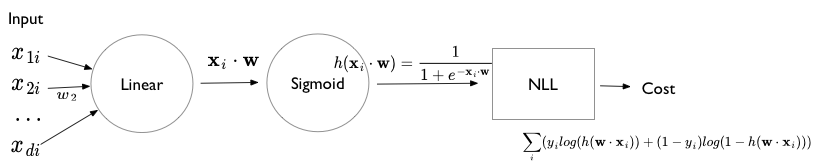
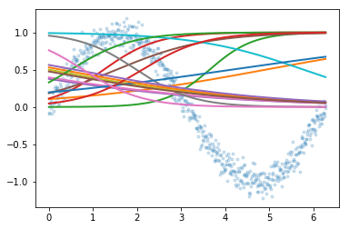
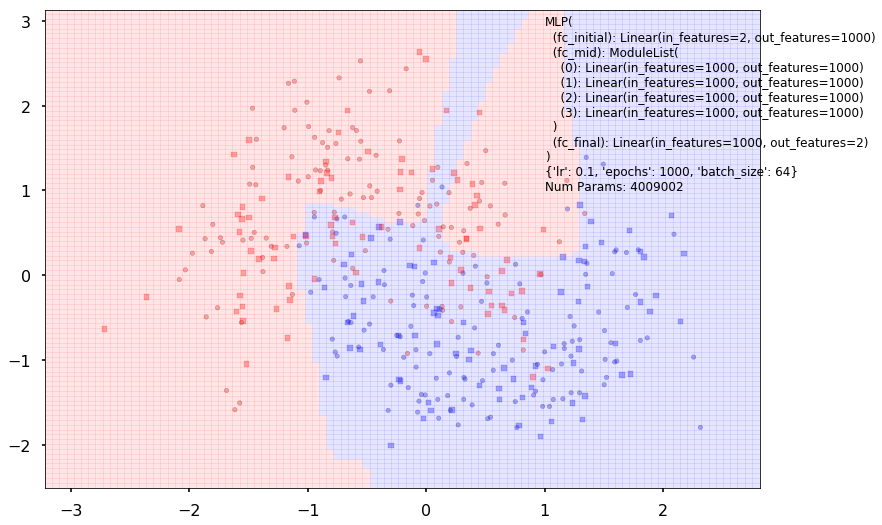

autoscale: true

#[fit]Day 2 Session 2

## Fully Connected Networks

---

## Logistic Regression


---

## Standard Layers



---

## Softmax formulation

- Identify $$p_i$$ and $$1-p_i$$ as two separate probabilities constrained to add to 1. That is $$p_{1i} = p_i ; p_{2i} = 1 - p_i. $$

- $$\renewcommand{\v}[1]{\mathbf #1}
p_{1i} = \frac{e^{\v{w_1} \cdot \v{x}}}{e^{\v{w_1} \cdot \v{x}} + e^{\v{w_2} \cdot \v{x}}}$$

- $$\renewcommand{\v}[1]{\mathbf #1}
p_{2i} = \frac{e^{\v{w_2} \cdot \v{x}}}{e^{\v{w_1} \cdot \v{x}} + e^{\v{w_2} \cdot \v{x}}}$$
- Can translate coefficients by fixed amount $$\psi$$ without any change

---

## NLL and gradients for Softmax

$${\cal L} = \prod_i p_{1i}^{\mathbb1_1(y_i)} p_{2i}^{\mathbb1_2(y_i)}$$

$$NLL = -\sum_i \left( \mathbb1_1(y_i) log(p_{1i}) + \mathbb1_2(y_i) log(p_{2i}) \right)$$

$$\renewcommand{\v}[1]{\mathbf #1}
\frac{\partial NLL}{\partial \v{w_1}} = -\sum_i \v{x_i} (y_i - p_{1i}), \frac{\partial NLL}{\partial \v{w_2}} = -\sum_i \v{x_i} (y_i - p_{2i})$$

---

## Units diagram for Softmax


---

## Rewrite NLL

$$\renewcommand{\v}[1]{\mathbf #1}
NLL = -\sum_i \left( \mathbb1_1(y_i) LSM_1(\v{w_1} \cdot \v{x}, \v{w_2} \cdot \v{x}) + \mathbb1_2(y_i) LSM_2(\v{w_1} \cdot \v{x}, \v{w_2} \cdot \v{x}) \right)$$

where $$\renewcommand{\v}[1]{\mathbf #1}
SM_1 = \frac{e^{\v{w_1} \cdot \v{x}}}{e^{\v{w_1} \cdot \v{x}} + e^{\v{w_2} \cdot \v{x}}}$$ puts the first argument in the numerator. Ditto for $$LSM_1$$ which is simply $$log(SM_1)$$.

---

##[fit] MLE for Logistic Regression


---

## Equations, layer by layer

$$\renewcommand{\v}[1]{\mathbf #1}
\v{z}^1 = \v{x_i}$$

$$\renewcommand{\v}[1]{\mathbf #1}
\v{z}^2 = (z^2_1, z^2_2) = (\v{w_1} \cdot \v{x_i}, \v{w_2} \cdot \v{x_i}) = (\v{w_1} \cdot \v{z^1_i}, \v{w_2} \cdot \v{z^1_i})$$

$$\renewcommand{\v}[1]{\mathbf #1}
\v{z}^3 = (z^3_1, z^3_2) = \left( LSM_1(z^2_1, z^2_2), LSM_2(z^2_1, z^2_2) \right)$$

$$\renewcommand{\v}[1]{\mathbf #1}
z^4 = NLL(\v{z}^3) = NLL(z^3_1, z^3_2) = - \sum_i \left( \mathbb1_1(y_i)z^3_1(i) + \mathbb1_2(y_i)z^3_1(i) \right)$$

---

## Reverse Mode Differentiation

$$\renewcommand{\v}[1]{\mathbf #1}
Cost = f^{Loss}(\v{f}^3(\v{f}^2(\v{f}^1(\v{x}))))$$

$$\renewcommand{\v}[1]{\mathbf #1}
\nabla_{\v{x}} Cost = \frac{\partial f^{Loss}}{\partial \v{f}^3}\,\frac{\partial \v{f}^3}{\partial \v{f}^2}\,\frac{\partial \v{f}^2}{\partial \v{f}^1}\frac{\partial \v{f}^1}{\partial \v{x}}$$

Write as:

$$\renewcommand{\v}[1]{\mathbf #1}
\nabla_{\v{x}} Cost = (((\frac{\partial f^{Loss}}{\partial \v{f}^3}\,\frac{\partial \v{f}^3}{\partial \v{f}^2})\,\frac{\partial \v{f}^2}{\partial \v{f}^1})\,\frac{\partial \v{f}^1}{\partial \v{x}})$$


---

## From Reverse Mode to Back Propagation

- Recursive Structure
- Always a vector times a Jacobian
- We add a "cost layer" to $$z^4$$. The derivative of this layer with respect to $$z^4$$ will always be 1.
- We then propagate this derivative back.

---

## Backpropagation

RULE1: FORWARD (`.forward` in pytorch) $$\renewcommand{\v}[1]{\mathbf #1}
\v{z}^{l+1} = \v{f}^l (\v{z}^l)$$

RULE2: BACKWARD (`.backward` in pytorch)
$$\renewcommand{\v}[1]{\mathbf #1}
\v{\delta^l} = \frac{\partial C}{\partial \v{z}^l}$$ or $$\delta^l_u = \frac{\partial C}{\partial z^l_u}$$.

$$\delta^l_u = \frac{\partial C}{\partial z^l_u} = \sum_v \frac{\partial C}{\partial z^{l+1}_v} \, \frac{\partial z^{l+1}_v}{\partial z^l_u} = \sum_v \delta^{l+1}_v \, \frac{\partial z^{l+1}_v}{\partial z^l_u} $$

---

In particular:

$$\delta^3_u = \frac{\partial z^{4}}{\partial z^3_u} = \frac{\partial C}{\partial z^3_u}$$

RULE 3: PARAMETERS

$$\frac{\partial C}{\partial \theta^l} = \sum_u \frac{\partial C}{\partial z^{l+1}_u} \, \frac{\partial z^{l+1}_u}{\partial \theta^l} = \sum_u \delta^{l+1}_u \frac{\partial z^{l+1}_u}{\partial \theta^l}$$

(backward pass is thus also used to fill the `variable.grad` parts of parameters in pytorch)

---


---

## Feed Forward Neural Nets: The perceptron


---

## Just combine perceptrons

- both deep and wide
- this buys us complex nonlinearity
- both for regression and classification
- key technical advance: BackPropagation with
- autodiff
- key technical advance: gpu

---

## Combine Perceptrons


---

## Non-Linearity


- we want a non-linearity as othersie combining linear regressions just gives a big honking linear regression
- the relu style is popular even with the kinks creating issues for differentiability because of the lack of saturations
- when need continuous derivatives we use sigmoid and tanh style functions which suffer from saturation issues (regularization helps)

---

## Simple MLP


---

## Forward Pass

We want to obtain gradients. For example: $$\frac{\partial Cost}{\partial param} = \frac{\partial z^6}{\partial w_1}$$

First we do the **Forward Pass**. Say we have 1 sample: (x=0.1, y=5). Initialize $$b_1, w_1, b_2, w_2, w_{o1}, w_{o2}, b_{o}$$. Then, plugging in the numbers will give us some Cost ($$z^5, z^6$$).


---

## Backward Pass

Now it is time to find the gradients, for eg,  $$\frac{\partial z^6}{\partial w_1}$$

The basic idea is to gather all parts that go to $$w_1$$, and so on and so forth. Now we perform GD (SGD) with some learning rate. 

The parameters get updated. Now we repeat the forward pass.

Thats it! Wait for convergence.


---

## More Complex MLP: 

3 hidden layers


---


---


---


---
##### Basic code outline

```python
dataset = torch.utils.data.TensorDataset(torch.from_numpy(xgrid.reshape(-1,1)), torch.from_numpy(ygrid))
loader = torch.utils.data.DataLoader(dataset, batch_size=64,shuffle=True)
def run_model(model, epochs):
    criterion = nn.MSELoss()
    lr, epochs, batch_size = 1e-1 , epochs , 64
    optimizer = torch.optim.SGD(model.parameters(), lr = lr )
    accum=[]
    for k in range(epochs):
        localaccum = []
        for localx, localy in iter(loader):
            localx = Variable(localx.float())
            localy = Variable(localy.float())
            output, _, _ = model.forward(localx)
            loss = criterion(output, localy)
            model.zero_grad()
            loss.backward()
            optimizer.step()
            localaccum.append(loss.data[0])
        accum.append((np.mean(localaccum), np.std(localaccum)))
    return accum
```

---

Backprop (Intuition)


---

## Backpropagation

RULE1: FORWARD (`.forward` in pytorch) $$\renewcommand{\v}[1]{\mathbf #1}
\v{z}^{l+1} = \v{f}^l (\v{z}^l)$$

RULE2: BACKWARD (`.backward` in pytorch)
$$\renewcommand{\v}[1]{\mathbf #1}
\v{\delta^l} = \frac{\partial C}{\partial \v{z}^l}$$ or $$\delta^l_u = \frac{\partial C}{\partial z^l_u}$$.

$$\delta^l_u = \frac{\partial C}{\partial z^l_u} = \sum_v \frac{\partial C}{\partial z^{l+1}_v} \, \frac{\partial z^{l+1}_v}{\partial z^l_u} = \sum_v \delta^{l+1}_v \, \frac{\partial z^{l+1}_v}{\partial z^l_u} $$

---

In particular:

$$\delta^3_u = \frac{\partial z^{4}}{\partial z^3_u} = \frac{\partial C}{\partial z^3_u}$$

RULE 3: PARAMETERS

$$\frac{\partial C}{\partial \theta^l} = \sum_u \frac{\partial C}{\partial z^{l+1}_u} \, \frac{\partial z^{l+1}_u}{\partial \theta^l} = \sum_u \delta^{l+1}_u \frac{\partial z^{l+1}_u}{\partial \theta^l}$$

(backward pass is thus also used to fill the `variable.grad` parts of parameters in pytorch)

---


## Universal Approximation

- any one hidden layer net can approximate any continuous function with finite support, with appropriate choice of nonlinearity
- under appropriate conditions, all of sigmoid, tanh, RELU can work
- but may need lots of units
- and will learn the function it thinks the data has, not what you think


---

#### One hidden, 1 vs 2 neurons 


---

#### Two hidden, 4 vs 8 neurons


---



---

## Relu (80, 1 layer) and tanh(40, 2 layer)


---

## Some rules of thumb

- relu and tanh are better non-linearities in hidden layers
- normalize your data by squashing to unit interval or standardizing so that no feature gets more important than the other
- outputs from non-linearity at any intermediate layer may need normalizing

---

## Half moon dataset (artificially GENERATED)


---

#### 1 layer, 2 vs 10 neurons


---

#### 2 layers, 20 neurons vs 5 layers, 1000 neurons



---

## Why does deep learning work?

1. Automatic differentiation 
2. GPU
3. Learning Representations

MLP's constructed "recursive functions":

$$s(w_n.z_n + b_n)$$ where $$z_n = s(w_{n-1}.z_{n-1}+b_{n-1})$$ and so on.

---

##[fit] Deep Learning Components

---

## Fully Connected layers

- also called dense layers
- these are the layers in MLPs
- we typically use them after convolutional layers to feed to a softmax to get probabilities


---

## 1-1 layers

- nonlinearities and softmax
- we dont really consider them layers ..you can think of them bolted to previous nodes in each layer.
- they are nor fully-connected..indeed theay are 1-1

---

## Dropout

- not really a layer, but a technique
- randomly sever connections to and from some fraction of nodes in "previous" layer
- a regularization method, it prevents overfitting by not allowing specific nodes to specialize to say, for example "cat eye detection" at the expense of other things. By severing, other neurons are forced to step in
- only during training, at prediction time the connections are restored


